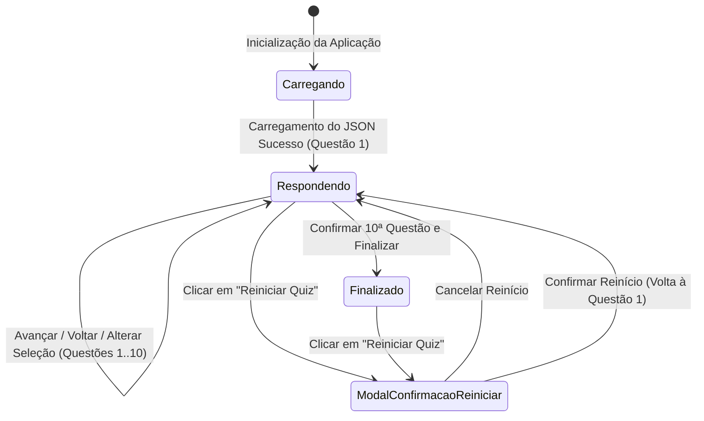

# Data Model: Quiz Computacional

**Feature Branch**: `001-quiz-computacional`
**Date**: 2026-09-26

## Entity Specifications

### 1. Question (Questão)

Representa uma pergunta individual contida no banco de dados do quiz.

| Campo | Tipo | Obrigatoriedade | Descrição / Validação |
|-------|------|-----------------|------------------------|
| `id` | `number` | Sim | Identificador único numérico (1 a 10). |
| `statement` | `string` | Sim | Texto legível contendo o enunciado da questão. |
| `options` | `Array<string>` | Sim | Lista com **exatamente 4** alternativas de resposta. |
| `correctIndex` | `number` | Sim | Índice numérico (0, 1, 2 ou 3) da alternativa correta. |
| `explanation` | `string` | Sim | Breve explicação didática do conceito para feedback de resposta. |

**Validações**:
- `options.length === 4` (conforme Princípio III da Constituição).
- `correctIndex >= 0 && correctIndex <= 3` (conforme Princípio IV da Constituição).

---

### 2. UserAnswer (Resposta do Estudante)

Armazena a seleção feita pelo estudante para uma determinada questão durante a sessão.

| Campo | Tipo | Obrigatoriedade | Descrição / Validação |
|-------|------|-----------------|------------------------|
| `questionId` | `number` | Sim | ID da questão respondida. |
| `selectedIndex` | `number \| null` | Não | Índice da alternativa selecionada (0, 1, 2, 3) ou `null` se ainda não respondida. |
| `isConfirmed` | `boolean` | Sim | Indica se a resposta atual foi confirmada visualmente pelo estudante. |

---

### 3. QuizState (Estado da Sessão)

Controla o progresso dinâmico e o fluxo de execução do estudante no quiz.

| Campo | Tipo | Descrição / Validação |
|-------|------|------------------------|
| `questions` | `Array<Question>` | Coleção de 10 questões carregadas do JSON. |
| `currentIndex` | `number` | Índice da questão em exibição (0 a 9). |
| `answers` | `Array<UserAnswer>` | Mapa/Array com as respostas gravadas para cada uma das 10 questões. |
| `isFinished` | `boolean` | `true` se o estudante concluiu a 10ª questão e está na tela de resultado. |

**Transições de Estado**:

---

### 4. QuizResult (Resultado Final)

Representa o cálculo determinístico de desempenho do estudante ao término do quiz.

| Campo | Tipo | Fórmula / Descrição |
|-------|------|----------------------|
| `totalQuestions` | `number` | Número total de questões (fixo em 10). |
| `correctCount` | `number` | Contagem de respostas onde `selectedIndex === correctIndex`. |
| `incorrectCount` | `number` | Contagem de respostas incorretas ou não respondidas (`totalQuestions - correctCount`). |
| `percentage` | `number` | Percentual de acertos calculado: `(correctCount / totalQuestions) * 100`. |

**Validação**:
- Cálculo 100% exato e determinístico (conforme Princípio VI da Constituição).
- Exemplo: 7 acertos, 3 erros → `70.0%`.
